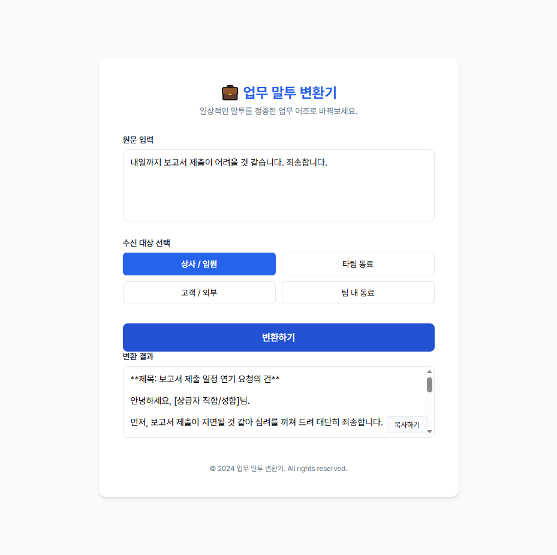
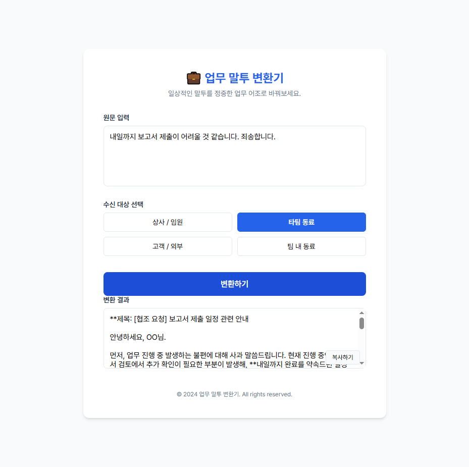
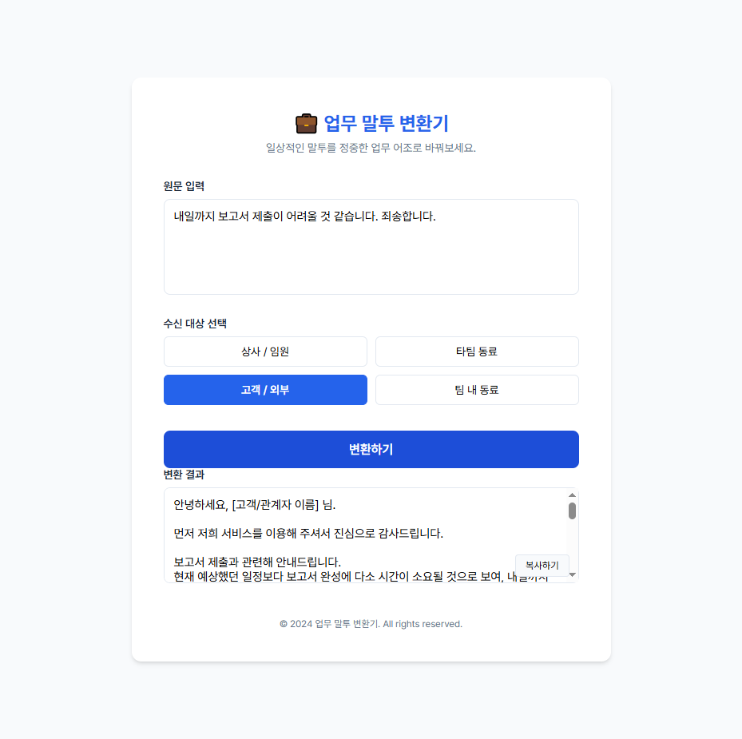
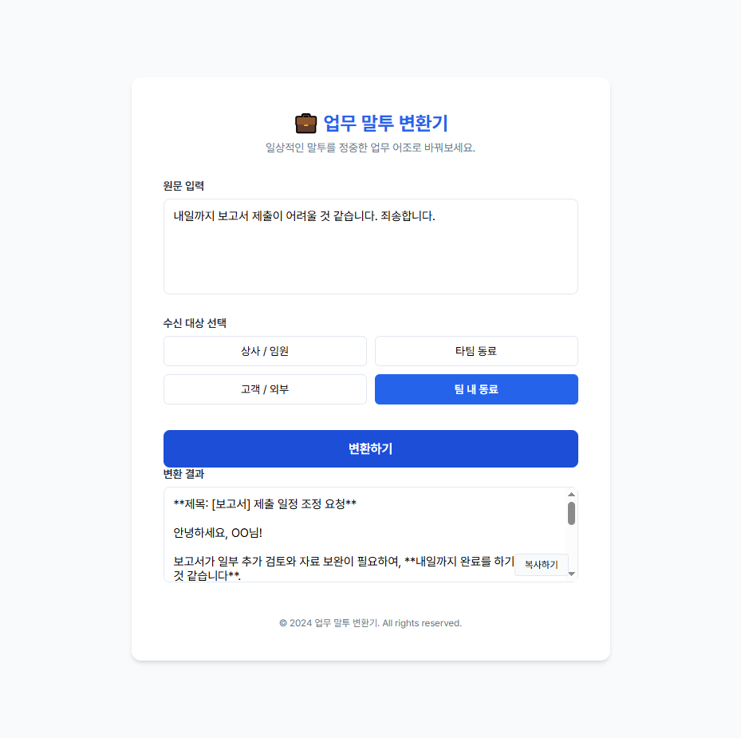

# 업무 말투 변환기 — 테스트 결과 보고서

## 1. 테스트 개요
- **테스트 일시**: 2026년 4월 24일
- **테스트 도구**: Playwright (MCP)
- **테스트 URL**: http://localhost:8000
- **테스트 목적**: 수신 대상별 말투 변환 로직의 정상 작동 여부 및 UI 검증

---

## 2. 테스트 케이스별 상세 결과

### [테스트 1] 상사 / 임원 대상 변환
- **원문**: "내일까지 보고서 제출이 어려울 것 같습니다. 죄송합니다."
- **수신 대상**: `boss` (상사 / 임원)
- **결과**: 격식 있는 제목과 정중한 사과, 구체적인 일정 조율 요청이 포함된 격식 있는 경어체로 변환됨.
- **스크린샷**: 

### [테스트 2] 타팀 동료 대상 변환
- **원문**: "내일까지 보고서 제출이 어려울 것 같습니다. 죄송합니다."
- **수신 대상**: `colleague` (타팀 동료)
- **결과**: 정중하면서도 협조적인 어조로, 지연 사유에 대한 책임감 있는 설명과 대안이 제시됨.
- **스크린샷**: 

### [테스트 3] 고객 / 외부 대상 변환
- **원문**: "내일까지 보고서 제출이 어려울 것 같습니다. 죄송합니다."
- **수신 대상**: `client` (고객 / 외부)
- **결과**: 서비스 마인드가 반영된 매우 친절하고 신뢰감 있는 어조로 변환됨.
- **스크린샷**: 

### [테스트 4] 팀 내 동료 대상 변환
- **원문**: "내일까지 보고서 제출이 어려울 것 같습니다. 죄송합니다."
- **수신 대상**: `team` (팀 내 동료)
- **결과**: 간결하고 실무적이며, 유연한 협업의 느낌을 살린 메시지로 변환됨.
- **스크린샷**: 

---

## 3. 종합 의견
- 모든 수신 대상에 대해 의도된 프롬프트 전략이 잘 적용되어 변환이 이루어짐을 확인하였습니다.
- 로딩 상태 UI 및 변환 후 결과 출력 과정이 오류 없이 정상 작동하였습니다.
- Upstage Solar-Pro2 API와의 연동이 안정적으로 유지되고 있습니다.

---
*보고서 작성자: Gemini CLI*
